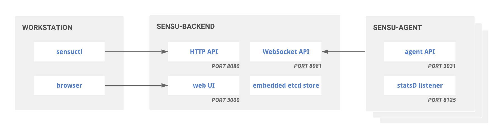
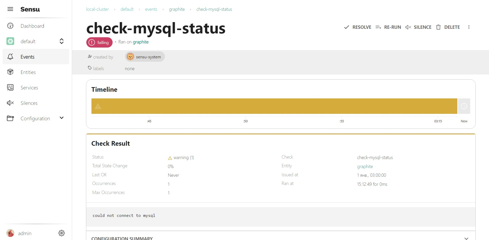
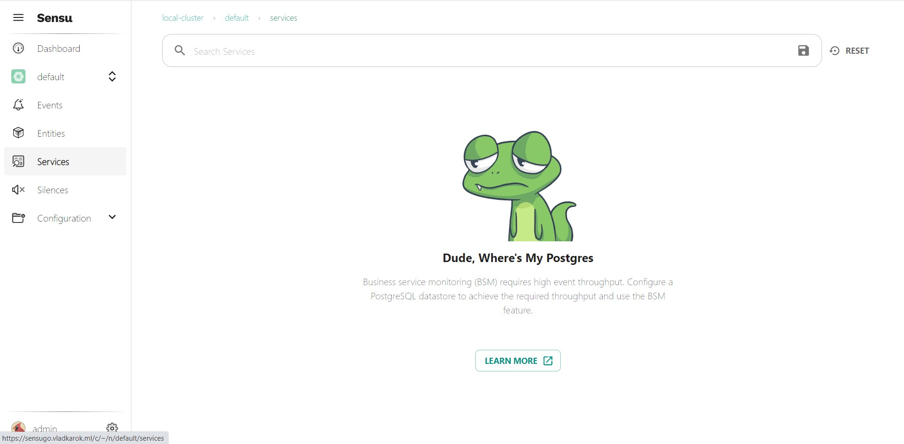
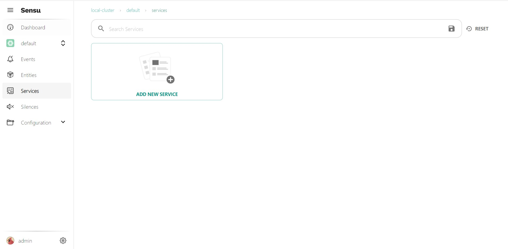

# Sensu Go

**Table of Contents**
- [Sensu Go](#sensu-go)
  - [Overview](#overview)
  - [Installation](#installation)
    - [Download](#download)
    - [Configure and start](#configure-and-start)
    - [Initialize](#initialize)
    - [Install sensuctl](#install-sensuctl)
  - [Install Sensu agents](#install-sensu-agents)
    - [Download](#download-1)
    - [Configure and start](#configure-and-start-1)
    - [Verify keepalive events](#verify-keepalive-events)
    - [Verify an example event](#verify-an-example-event)
  - [PostgreSQL datastore](#postgresql-datastore)
  - [Grafana datasource](#grafana-datasource)
  - [Some checks](#some-checks)
    - [CPU check](#cpu-check)
    - [Memory check](#memory-check)

## Overview  
[Repository](https://github.com/sensu/sensu-go)  
[Documentation](https://docs.sensu.io/sensu-go/latest/operations/deploy-sensu/install-sensu/)  
[Workshop](https://github.com/sensu/sensu-go-workshop)

**Architecture**



**Ports**:

Sensu backends require the following ports:

Port | Protocol | Description
--- | --- | ---
2379 | gRPC | Sensu storage client: Required for Sensu backends using an external etcd instance
2380 | gRPC | Sensu storage peer: Required for other Sensu backends in a cluster
3000 | HTTP/HTTPS | Sensu web UI: Required for all Sensu backends using a Sensu web UI
6060 | HTTP/HTTPS | Required for all Sensu backends when performance profiling is enabled via debug setting
8080 | HTTP/HTTPS | Sensu API: Required for all users accessing the Sensu API
8081 | WS/WSS | Agent API (backend WebSocket): Required for all Sensu agents connecting to a Sensu backend

The Sensu agent uses the following ports:

Port | Protocol | Description
--- | --- | ---
3030 | TCP/UDP | Sensu agent socket: Required for Sensu agents using the agent socket
3031 | HTTP | Sensu agent API: Required for all users accessing the agent API
8125 | UDP  | StatsD listener: Required for all Sensu agents using the StatsD listener

The agent TCP and UDP sockets are deprecated in favor of the [agent API](https://docs.sensu.io/sensu-go/latest/observability-pipeline/observe-schedule/agent#create-observability-events-using-the-agent-api).

## Installation

 ### Download

 ```bash
 curl -s https://packagecloud.io/install/repositories/sensu/stable/script.deb.sh | sudo bash
 sudo apt-get install sensu-go-backend
 ```

 ### Configure and start

 You can configure the Sensu backend with `sensu-backend start` flags (recommended) or an `/etc/sensu/backend.yml` file. The Sensu backend requires the `state-dir` flag at minimum, but other useful configurations and templates are available.

 *Copy the config template from the docs*

 ```bash
sudo curl -L https://docs.sensu.io/sensu-go/latest/files/backend.yml -o /etc/sensu/backend.yml
 ```

 **Adjust configuration**

 For my case I need to change default ports 8080 and 3000 (API and WEB UI accordingly) to 8082 and 3001 due to conflict with already installed software.

```bash
sudo vim /etc/sensu/backend.yml
```

```yml
#....
# SKIPPED CONFIG PART
#....

##
# api configuration
##
api-listen-address: "[::]:8082" #listen on all IPv4 and IPv6 addresses
#api-request-limit: 512000
api-url: "http://localhost:8082"

#....
# SKIPPED CONFIG PART
#....

#dashboard-key-file: "/path/to/tls/separate-webui-key.pem"
dashboard-port: 3001

#....
# SKIPPED CONFIG PART
#....
```


 *Start sensu-backend using a service manager*

 ```bash
sudo systemctl start sensu-backend
sudo systemctl enable sensu-backend
 ```

 *Verify that the backend is running*

 ```bash
sudo systemctl status sensu-backend
 ```

### Initialize

**With the backend running**, run `sensu-backend init` to set up your Sensu administrator username and password. In this initialization step, you only need to set environment variables with a username and password string — no need for role-based access control (RBAC).

Replace `<username>` and `<password>` with the username and password you want to use:

```bash
export SENSU_BACKEND_CLUSTER_ADMIN_USERNAME=<username>
export SENSU_BACKEND_CLUSTER_ADMIN_PASSWORD=<password>
sensu-backend init
```
### Install sensuctl

If you added [sensu repository before](#download), just run 

```bash
sudo apt-get install sensu-go-cli
```
Otherwise, add the repository

```bash
curl -s https://packagecloud.io/install/repositories/sensu/stable/script.deb.sh | sudo bash
sudo apt-get install sensu-go-cli
```

To start using sensuctl, run `sensuctl configure` and log in with your user credentials, namespace, and [Sensu backend](https://docs.sensu.io/sensu-go/latest/operations/deploy-sensu/install-sensu/#install-the-sensu-backend) URL. To configure sensuctl using default values:

```
sensuctl configure -n \
--username 'YOUR_USERNAME' \
--password 'YOUR_PASSWORD' \
--namespace default \
--url 'http://127.0.0.1:8080'
```

## Install Sensu agents

### Download

**Add the Sensu repository**
```
curl -s https://packagecloud.io/install/repositories/sensu/stable/script.deb.sh | sudo bash
```
**Install the sensu-go-agent package**
```
sudo apt-get install sensu-go-agent
```

### Configure and start

You can configure the Sensu agent with `sensu-agent start` flags (recommended) or an `/etc/sensu/agent.yml` file. The Sensu agent requires the `--backend-url` flag at minimum, but other useful configurations and templates are available.

```bash
sudo curl -L https://docs.sensu.io/sensu-go/latest/files/agent.yml -o /etc/sensu/agent.yml

sudo systemctl start sensu-agent

```

### Verify keepalive events

```bash
sensuctl entity list
```

### Verify an example event

```bash
curl -X POST \
-H 'Content-Type: application/json' \
-d '{
  "check": {
    "metadata": {
      "name": "check-mysql-status"
    },
    "status": 1,
    "output": "could not connect to mysql"
  }
}' \
http://127.0.0.1:3031/events
```

And after execution of previous command you can find relative event in UI:




## PostgreSQL datastore  



[Documentation](https://docs.sensu.io/sensu-go/latest/operations/deploy-sensu/datastore/#postgresql-requirements)

When configured with a PostgreSQL event store, Sensu connects to PostgreSQL to store and retrieve event data in place of etcd. *Etcd continues to store Sensu entity and configuration data*. You can access event data stored in PostgreSQL using the same Sensu web UI, API, and sensuctl processes as etcd-stored events.

> **Note:** Next steps require **PostgreSQL** database server to be already installed.

Adjust PostgreSQL config as from previous link.  
Create user and db for Sensu Go.
```bash
sudo -u postgres psql
```
```postgres
CREATE USER sensugo_db_user WITH PASSWORD '$STRONG_PASSWORD';
CREATE DATABASE sensugo_db WITH OWNER sensugo_db_user;
\q
```

Create config

```bash
sudo vim /etc/sensu/postgres.yml
```
Content:
```yml
---
type: PostgresConfig
api_version: store/v1
metadata:
  name: my-postgres
spec:
  batch_buffer: 0
  batch_size: 1
  batch_workers: 0
  dsn: "postgresql://sensugo_db_user:$STRONG_PASSWORD:5432/sensugo_db"
  max_conn_lifetime: 5m
  max_idle_conns: 2
  pool_size: 20
  strict: true
  enable_round_robin: true
```

Then, use sensuctl [configured as the admin user](https://docs.sensu.io/sensu-go/latest/sensuctl/#first-time-setup-and-authentication) to activate the PostgreSQL event store.
```
sensuctl create --file /etc/sensu/postgres.yml
```
Then:


## Grafana datasource

[GitHub](https://github.com/sensu/grafana-sensu-go-datasource#setup)

## Some checks

### CPU check

Search metrics [here](https://bonsai.sensu.io/)

Search `cpu` and select `sensu-plugins/sensu-plugins-cpu-checks`.  

**Adding the required dynamic assets**

You can find the download command:

```
sensuctl asset add sensu-plugins/sensu-plugins-cpu-checks -r cpu-checks-plugins
```

`-r cpu-checks-plugins` is used for renaming the plugin.

We also need the ruby runtime, because sensu-cpu-check is a ruby script that needs ruby to run.

```
sensuctl asset add sensu/sensu-ruby-runtime -r sensu-ruby-runtime
```

We can verify that these have been downloaded using

```
sensuctl asset list
```

**Configure entity subscription**
```
sensuctl entity list
sensuctl entity update <entity_name>
```
and subsribe it to `system` check.

**Creating the check**

```
sensuctl check create check_cpu \
--command 'check-cpu.rb -w 75 -c 90' \
--interval 30 \
--subscriptions system \
--runtime-assets cpu-checks-plugins,sensu-ruby-runtime
```
**Verifying**
```
sensuctl check info check_cpu --format yaml
```

```
sensuctl event list
```

### Memory check

**Download**

```
sensuctl asset add sensu-plugins/sensu-plugins-memory-checks -r check-memory-usage
```

**Create check**

```
sensuctl check create check-memory-usage \
--command 'check-memory-usage --warning 80 --critical 90' \
--interval 30 \
--subscriptions system \
--runtime-assets check-memory-usage
```

As we added the same subscription to the check, we can verify that the check is working by running

```
sensuctl event list
```