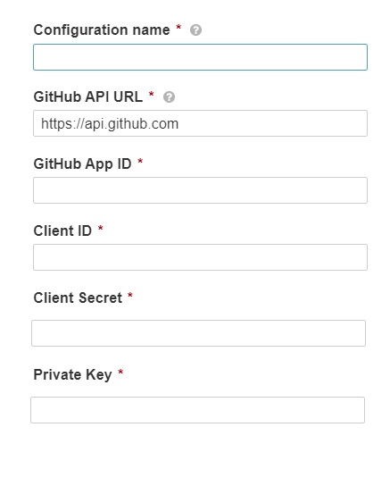
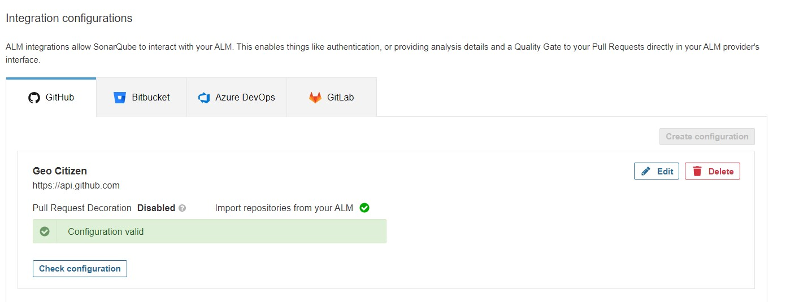
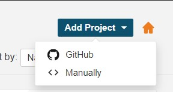
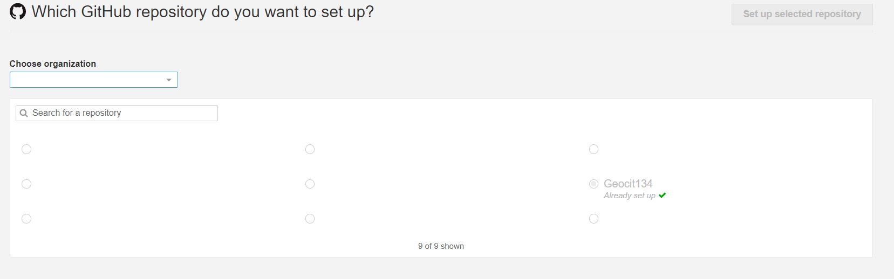
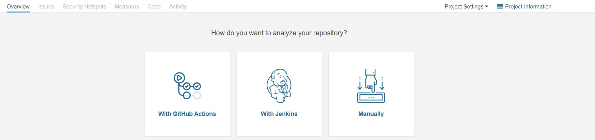
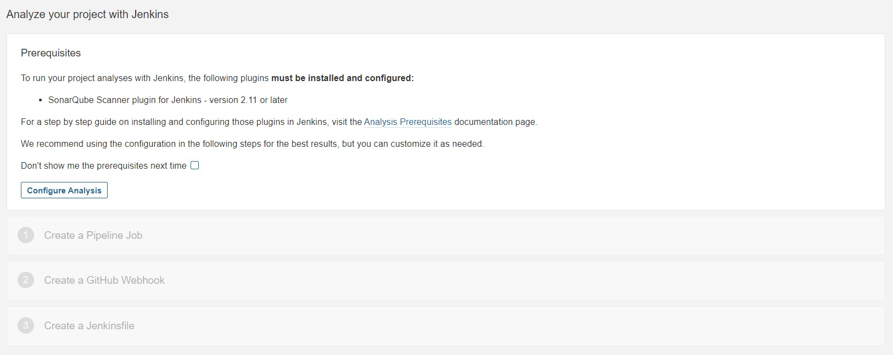
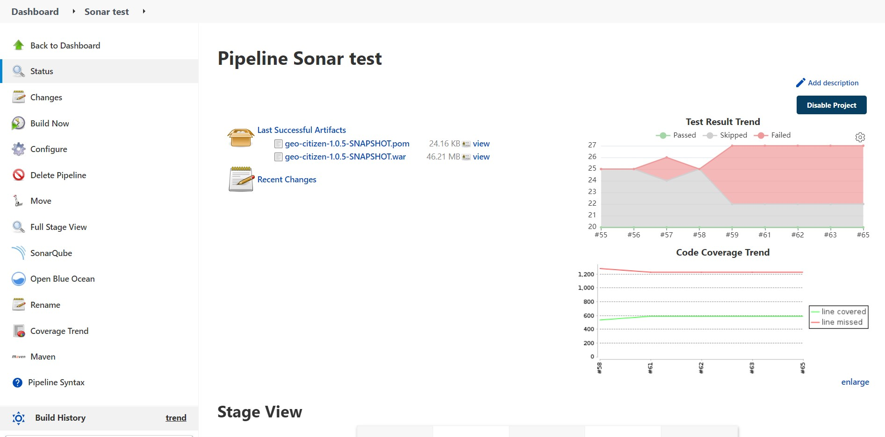
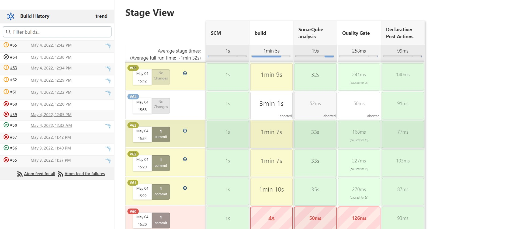
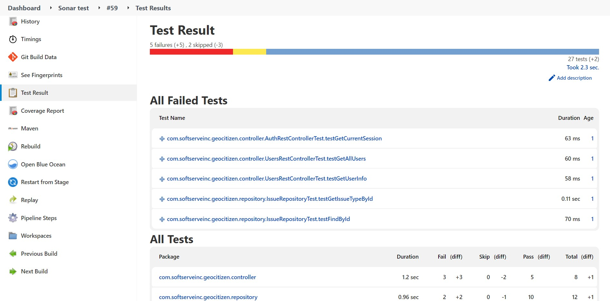
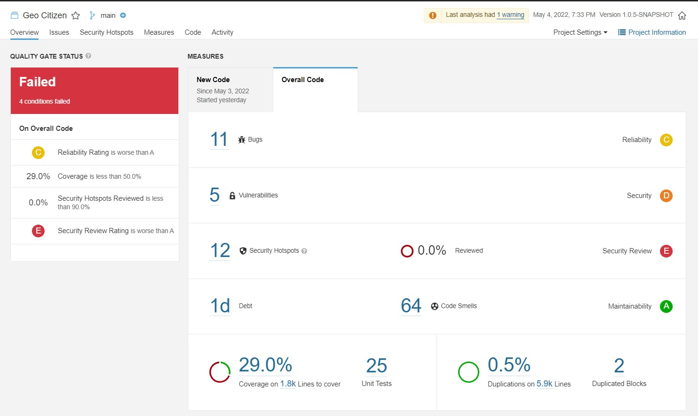

# Sonarqube

- [Sonarqube](#sonarqube)
  - [Installation](#installation)
  - [Configuration](#configuration)
  - [Fixing project](#fixing-project)
    


https://www.sonarqube.org/
https://docs.sonarqube.org/latest/
and with the help of [this](https://thenewstack.io/how-to-install-the-sonarqube-security-analysis-platform/)

## Installation

**Hardware reqiurements**

```bash
sudo vim /etc/sysctl.conf
```

Add to the bottom (`shift+G`)

```bash
vm.max_map_count=524288
fs.file-max=131072
ulimit -n 131072
ulimit -u 8192
```
Save and close the file.  
Then 

```bash
sudo vim /etc/security/limits.conf
```

Add to the bottom (`shift+G`)

```bash
sonarqube   -   nofile   131072
sonarqube   -   nproc    8192
```
Save and close the file.  
In order for these changes to take effect, reboot the system

```bash
sudo reboot now
```

**Install OpenJDK 11**  

SonarQube depends on Java. For that, we’ll install OpenJDK 11, which can be done with the command:

```bash
sudo apt-get install openjdk-11-jdk -y
```

That was easy. Let’s move on.

**Install and Configure the Database**

On Linux, SonarQube only works with PostgreSQL, which means we have to take a few extra steps to get it installed. First, download the PostgreSQL GPG key with the command:
```bash
wget -q https://www.postgresql.org/media/keys/ACCC4CF8.asc -O - | sudo apt-key add -
```
Next, add the PostgreSQL apt repository by running the command:
```bash
sudo sh -c 'echo "deb http://apt.postgresql.org/pub/repos/apt/ lsb_release -cs-pgdg main" >> /etc/apt/sources.list.d/pgdg.list'
```
Update apt with the command:
```
sudo apt-get update
```
Install PostgreSQL with by issuing:
```
sudo apt install postgresql postgresql-contrib -y
```
Once the installation completes, start the PostgreSQL service with the command:
```
sudo systemctl start postgresql
```
Enable the service to start at boot with the command:
```
sudo systemctl enable  postgresql
```

Switch to the postgres user with the command:
```
su - postgres
```
Let’s create a new database user:
```
createuser sonar
```
Enter the postgresql

```
psql
```

Set a password for the sonar user with the command:
```postgres
ALTER USER sonar WITH ENCRYPTED PASSWORD 'PWORD';
```
Where PWORD is a strong/unique password.

Create the SonarQube database with the command:
```postgres
CREATE DATABASE sonarqube OWNER sonar;
```
Modify the privileges, such that the sonar user can access/use/modify the data with the command:
```postgres
GRANT ALL PRIVILEGES ON DATABASE sonarqube to sonar;
```
Exit the database console with the command:
```postgres
\q
```
Type exit to leave the postres user.

**Download and Unpack SonarQube**

We’ll be installing **SonarQube 8.9.8 LTS (April 2022)**. You’ll want to check the [official SonarQube download page](https://www.sonarqube.org/downloads/) or [this](https://binaries.sonarsource.com/?prefix=Distribution/sonarqube/) to make sure you’re installing the latest version.

```
VERSION=8.9.8.54436
wget https://binaries.sonarsource.com/Distribution/sonarqube/sonarqube-${VERSION}.zip
```
Install zip with the command:
```
sudo apt install zip -y
```
Unpack the downloaded file with the command:
```
unzip sonarqube*.zip
```
Move (and rename) the newly created file with the command:
```
sudo mv sonarqube-${VERSION} /opt/sonarqube
```

**Create a New User and Group**

```
sudo groupadd sonar
sudo useradd -c "SonarQube - User" -d /opt/sonarqube/ -g sonar sonar
sudo chown -R sonar:sonar /opt/sonarqube/
```

**Configure SonarQube**

Open the configuration file with the command:

```
sudo vim /opt/sonarqube/conf/sonar.properties
```

Remove the # character and modify the following lines so they reflect the changes below:

```properties
sonar.jdbc.username=sonar
sonar.jdbc.password=PASSWORD
sonar.jdbc.url=jdbc:postgresql://localhost/sonarqube
sonar.search.javaOpts=-Xmx512m -Xms512m -XX:MaxDirectMemorySize=256m -XX:+HeapDumpOnOutOfMemoryError
```
Where PASSWORD is the PostgreSQL user password.

Finally, make sure to edit the following lines so they look like what you see here:

```properties
sonar.web.port=9000
sonar.web.javaAdditionalOpts=-server
sonar.web.javaOpts=-Xmx512m -Xms512m -XX:+HeapDumpOnOutOfMemoryError
sonar.log.level=INFO
sonar.path.logs=logs
```
> **Note!** If you already have 9000 and 9001 ports taken for another services, you need to pick another ports and later adjust Nginx configuration.  
> 
Save and close the file.  
Next, we need to change the user that will run the SonarQube server. Issue the command:

```
sudo vim /opt/sonarqube/bin/linux-x86-64/sonar.sh
```
At the bottom of that file (~49 line), make sure the `RUN_AS_USER` line looks like:
```bash
RUN_AS_USER=sonar
```

Save and close the file.  

**Create a Startup File**

Create a systemd startup file

```bash
sudo vim /etc/systemd/system/sonarqube.service
```

```properties
[Unit]
Description=SonarQube service
After=syslog.target network.target

[Service]
Type=forking
ExecStart=/opt/sonarqube/bin/linux-x86-64/sonar.sh start
ExecStop=/opt/sonarqube/bin/linux-x86-64/sonar.sh stop
User=sonar
Group=sonar
Restart=always
LimitNOFILE=65536
LimitNPROC=4096

[Install]
WantedBy=multi-user.target
```
Save and close the file.  

Start and enable the SonarQube

```
sudo systemctl start sonarqube
sudo systemctl enable sonarqube
```

**Install and Configure NGINX**

SonarQube is a web-based tool, so we need a web server. For this, we’ll use NGINX

```
sudo apt-get install nginx -y
sudo systemctl start nginx
sudo systemctl enable nginx
```

In order for NGINX to know about SonarQube, we must create a configuration file with the command:

```
sudo vim /etc/nginx/sites-available/sonarqube.conf
```

```nginx
server{

listen      80;
server_name YOUR_DOMAIN.com www.YOUR_DOMAIN.com;
access_log  /var/log/nginx/sonar.access.log;
error_log   /var/log/nginx/sonar.error.log;
proxy_buffers 16 64k;
proxy_buffer_size 128k;

location / {
proxy_pass  http://127.0.0.1:9000;
proxy_next_upstream error timeout invalid_header http_500 http_502 http_503 http_504;
proxy_redirect off;
proxy_set_header    Host            $host;
proxy_set_header    X-Real-IP       $remote_addr;
proxy_set_header    X-Forwarded-For $proxy_add_x_forwarded_for;
proxy_set_header    X-Forwarded-Proto http;
}
}
```
> Change `YOUR_DOMAIN.com` according to your environment.

Create a symbolic link with the command:

```
sudo ln -s /etc/nginx/sites-available/sonarqube.conf /etc/nginx/sites-enabled/sonarqube.conf
```
And restart NGINX with the command:

```
sudo systemctl restart nginx
```

**SSL**

Install certbot with the command:

```
sudo apt-get install certbot -y
```
You need to have **A** DNS records for your `domain` and `www.domain` name. After that you can perform certificate issue with the command:

```
sudo certbot --nginx -d YOUR_DOMAIN.com -d www.YOUR_DOMAIN.com
```

## Configuration

You can optionally configure GitHub integration, just follow thos guide.

https://docs.sonarqube.org/latest/analysis/github-integration/  

Also this is the official guide to create github app:  
https://docs.github.com/en/developers/apps/building-github-apps/creating-a-github-app

And install this app to your account

https://docs.github.com/en/developers/apps/managing-github-apps/installing-github-apps

After APP creation, you can navigate to your sonarqube `Administration/Configuration/General Configuration/ALM Integrations` where you can click on `GitHub` and configure it with nessesary information you created on previous steps:  
  
After that you should be able to see successful message:  
  
Then you can go in your SonarQube main page and click on `Add project` and Github will be added as an option.  
  
Then select organization and repository:  
  
Then click on `Set up selected repository` button and you will be able to see next message:
  
We will choose **Jenkins**  
  
You can follow along this recomendations. Remember to add `<sonar.projectKey>` to **pom.xml** as said in example.  
But wher we are talking about Jenkins pipeline I recommend to use examples from documentation https://sonar.vladkarok.ml/documentation/analysis/scan/sonarscanner-for-jenkins/  


```groovy
pipeline {
    agent any
    stages {
        stage('SCM') {
            steps {
                git url: 'https://github.com/foo/bar.git'
            }
        }
        stage('build && SonarQube analysis') {
            steps {
                withSonarQubeEnv('My SonarQube Server') {
                    // Optionally use a Maven environment you've configured already
                    withMaven(maven:'Maven 3.5') {
                        sh 'mvn clean package sonar:sonar'
                    }
                }
            }
        }
        stage("Quality Gate") {
            steps {
                timeout(time: 1, unit: 'HOURS') {
                    // Parameter indicates whether to set pipeline to UNSTABLE if Quality Gate fails
                    // true = set pipeline to UNSTABLE, false = don't
                    waitForQualityGate abortPipeline: true
                }
            }
        }
    }
}
```


## Fixing project

In general, we need to fix `pom.xml`.  
First - add `<sonar.projectKey>` as said on previous steps.  
Then we need to [install](https://mvnrepository.com/artifact/org.sonarsource.scanner.maven/sonar-maven-plugin) `sonar-maven-plugin` in dependencies section:

```xml
<dependency>
    <groupId>org.sonarsource.scanner.maven</groupId>
    <artifactId>sonar-maven-plugin</artifactId>
    <version>3.9.1.2184</version>
</dependency>
```

Then in `build` section add [jacoco](https://mvnrepository.com/artifact/org.jacoco/jacoco-maven-plugin) plugin

```xml
<plugin>
    <groupId>org.jacoco</groupId>
    <artifactId>jacoco-maven-plugin</artifactId>
    <version>0.8.7</version>
    <executions>
        <execution>
            <id>prepare-agent</id>
		        <goals>
		            <goal>prepare-agent</goal>
		        </goals>
		    </execution>
		    <execution>
		        <id>generate-report</id>
		        <phase>verify</phase>
		        <goals>
		            <goal>report</goal>
		        </goals>
		    </execution>
		</executions>
</plugin>
```

And [surefire](https://maven.apache.org/surefire/maven-surefire-report-plugin/usage.html) plugin

```xml
<plugin>
    <groupId>org.apache.maven.plugins</groupId>
    <artifactId>maven-surefire-plugin</artifactId>
    <version>3.0.0-M6</version>
   	<configuration>
   	    <testFailureIgnore>true</testFailureIgnore>
   	</configuration>
</plugin>
```

And we need to remove `@Ignore` strings in test files.

```
find src/test/java/com/softserveinc/geocitizen -type f -exec sed -i "s/^\\@Ignore/\\/\\/@Ignore/g" {} +
```

Also we need to have accessible database for testing.

In the end we will have the next pipeline:
  
```groovy

pipeline {
    agent {
        label 'maven'
    }
    environment {
        sonar_username = credentials('sonar_db_username')
        sonar_password = credentials('sonar_db_password')
        sonar_database = credentials('sonar_db_database')
        sonar_db_ip    = '10.138.0.17'
    }
    stages {
        stage('SCM') {
            steps {
                git branch: 'main', credentialsId: 'github-ssh', url: 'git@github.com:Vladkarok/Geocit134.git'
            }
        }
        stage('build') {
            steps {
                withMaven(maven:'3.6.3') {
                    sh '''#!/bin/bash
                        find src/test/java/com/softserveinc/geocitizen -type f -exec sed -i "s/@Ignore//g" {} + 
                        sed -i -E \\
                            "s/(db.username=postgres)/db.username=${sonar_username}/g;
                            s/(db.password=postgres)/db.password=${sonar_password}/g;
                            s/(postgresql:\\/\\/localhost)/postgresql:\\/\\/${sonar_db_ip}/g
                            s/(ss_demo_1)$/${sonar_database}/g;" src/main/resources/application.properties
                        mvn clean verify
                        '''
                }
            }
        }
        stage('SonarQube analysis') {
            steps {
                withSonarQubeEnv('MySonarQube') {
                    // Optionally use a Maven environment you've configured already
                    withMaven(maven:'3.6.3') {
                        sh 'mvn sonar:sonar'
                    }
                }
            }
        }
        stage("Quality Gate") {
            steps {
                timeout(time: 1, unit: 'HOURS') {
                    // Parameter indicates whether to set pipeline to UNSTABLE if Quality Gate fails
                    // true = set pipeline to UNSTABLE, false = don't
                    waitForQualityGate abortPipeline: true
                }
            }
        }
    }
    post {
        always {
            cleanWs()
        }
    }  
}
```

We can optionally add to Jenkins plugin - [JaCoCo plugin](https://plugins.jenkins.io/jacoco/)

After that you can run the pipeline and see the results in SonarQube.

Here are some sample screenshots from Jenkins and SonarQube:

  



