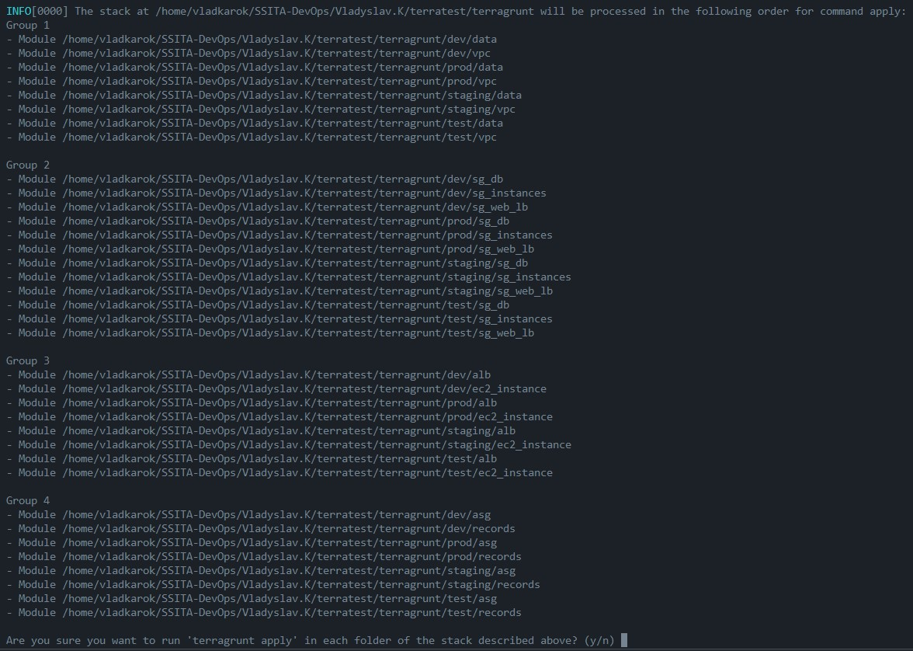
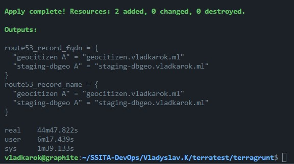
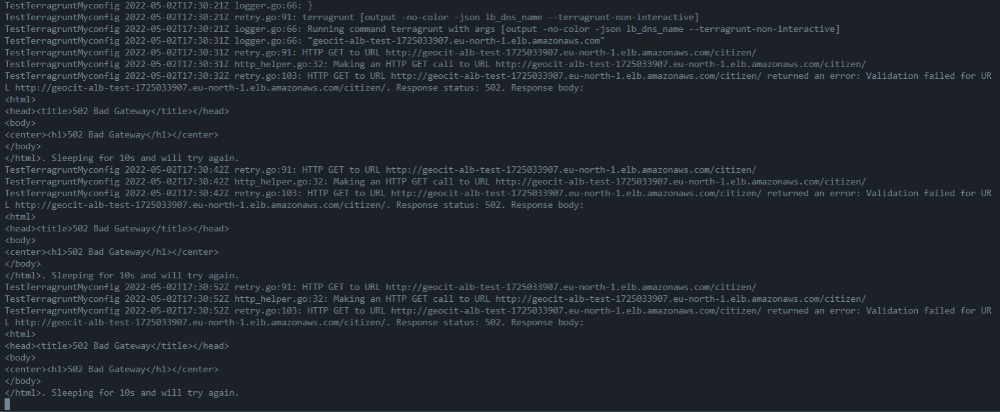
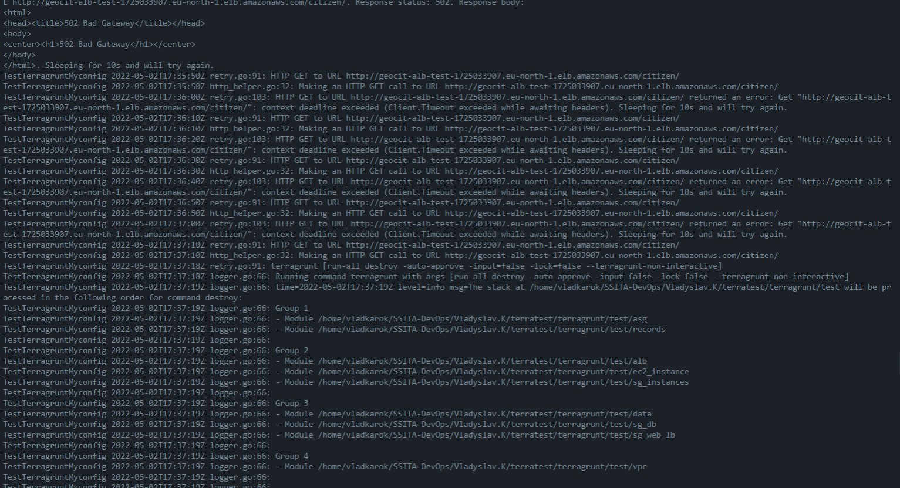
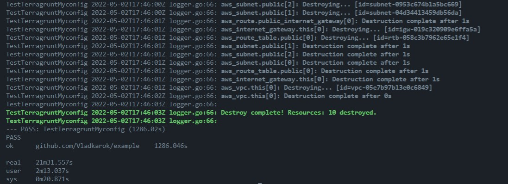

# Terragrunt & Testing

## Terragrunt

This repository contains Terragrunt environment (`dev`, `staging`, `prod`, `test`) folders. It has hardcoded nexus username to login to Nexus repository, Nexus URL for docker login, docker images names and maybe something else.  
In order to run terragrunt, it also required to be **authorized to AWS** and have `nexus_docker_password` environment variable set. like this:

```
export nexus_docker_password=<your_password>
```

Then you can run:

```
terragrunt run-all apply
```

Output:



It can take some time to finish...



## Testing

https://github.com/gruntwork-io/terratest  
https://terratest.gruntwork.io/docs/getting-started/introduction/

```
go test -v -run TestTerragruntMyconfig -timeout 30m
```
Starting...

Found responce body...

Destroyed...
